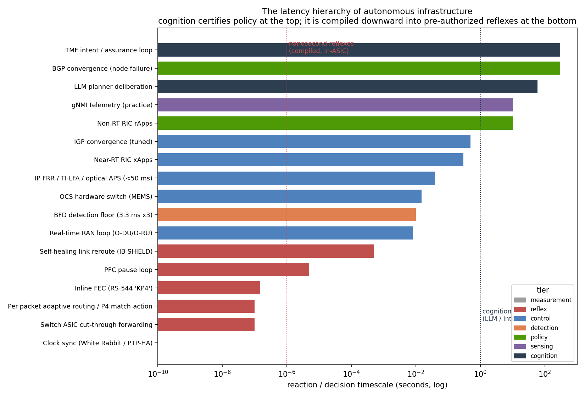

# Governed Autonomy for GPU Clusters and Networks: from human intent to nanosecond in-ASIC reflexes

**An autonomous control plane for infrastructure is not an LLM with `kubectl` — it is a governed loop where a planner proposes, a separate referee approves against an allow-list, typed tools execute, and every action is verified against a certified contract.** This repository is the architecture for that loop across two domains — the AI cluster and the autonomous network — plus its signature evidence: a sourced **latency hierarchy** showing that autonomy never makes one loop faster; it certifies policy at human timescales and compiles it downward into pre-authorized reflexes.

**The through-line:** the [chaos-fidelity standard](https://github.com/dimaggi-ai/ai-cluster-chaos-fidelity) certifies that a recovery behavior *works*; [reliability economics](https://github.com/dimaggi-ai/reliability-economics) prices *what it is worth*; this repo is the controller that must *pass those experiments before it is trusted* — and the promotion of any action up the autonomy ladder is machine-checked against exactly that evidence [18].

*Fifth in the DIMAGGI series on turning GPU capital into usable compute. All claims trace to [REFERENCES.md](REFERENCES.md).*

---

## The signature exhibit: the latency hierarchy



"Can infrastructure react in nanoseconds?" is the wrong question — nanosecond *decision-making* exists nowhere. The right question is **how far down the latency hierarchy a governed system can push policy it has certified**, and the answer is already sub-microsecond for compiled models (switch-ASIC forwarding, per-packet adaptive routing, in-network P4 inference at <450 ns/packet) while the sub-10 ms RAN tier has no standardized control point at all yet. Every rung is sourced; the figure and table are generated from one data file. Full reasoning: [docs/latency-hierarchy.md](docs/latency-hierarchy.md).

## The architecture

Five planes kept separate so a planner cannot edit policy by talking well (intent, decision, world-model + checker, sense, actuation); a **referee that is a different identity from the healer** ("if one process can propose and approve a drain, you have no control plane"); a cycle that **fails closed when the brain is dark**; and an **autonomy ladder (L0–L4)** where an action class is promoted only on the evidence of a green chaos experiment. Details: [docs/architecture.md](docs/architecture.md). The same discipline instantiated for DC fabric, IP, optical, and RAN — aligned precisely to TM Forum's AN levels and O-RAN's loop timescales — is in [docs/autonomous-networks.md](docs/autonomous-networks.md).

## The machine-checkable artifact: the promotion gate

Consistent with the standard's "fail the PR, not the prose" ethos, [`gate/`](gate/) refuses an autonomy-promotion record that claims a level it has not earned: L2+ must cite a certifying chaos experiment, carry evidence, and hold its abort; L4 needs a control-plane-dark drill and a rollback drill in one declared pool; irreversible fault domains (production training fabric, power interlocks) are capped at L1.

```
pip install pyyaml matplotlib
make test        # promotion-gate validator + rejection tests
make exhibit     # regenerate the latency-hierarchy figure from its data file
```

Or install the gate as a command and check your own promotion records:

```
pip install git+https://github.com/dimaggi-ai/governed-autonomy
promotion-gate my-promotion-record.yaml    # refuse it if the level is unearned
```

## Honest scope

This is an **architecture and a sourced latency map**, not a cluster or network simulator — the quantitative work lives in the sibling repos. The network chapter is standards-aligned prose evidenced by early public field demonstrations, not a benchmark; where an earlier draft paraphrased TM Forum or O-RAN loosely, the corrected framing is stated inline. The [latency hierarchy](docs/latency-hierarchy.md#three-honest-qualifications) carries its own qualifications (the nanosecond tier is thin; the sensing floor binds first).

## Series — turning GPU capital into usable compute

- **GPU Cluster Networking** ([network-vs-more-gpus](https://github.com/dimaggi-ai/network-vs-more-gpus))
- **GPU Cluster Scheduling** ([scheduler-vs-more-gpus](https://github.com/dimaggi-ai/scheduler-vs-more-gpus))
- **Chaos Fidelity Standard** ([ai-cluster-chaos-fidelity](https://github.com/dimaggi-ai/ai-cluster-chaos-fidelity)) — certifies the experiments
- **Reliability Economics** ([reliability-economics](https://github.com/dimaggi-ai/reliability-economics)) — prices which recovery policy wins where
- **Governed Autonomy** (this work) — the controller that must pass them, cluster and network

---

*Margaret (Maggie) Nanyonga — Founder & Principal Architect, [DIMAGGI AI](https://dimaggi.ai). Governed AI infrastructure: the control, reliability, and audit layer for autonomous systems operating production networks and compute.*
